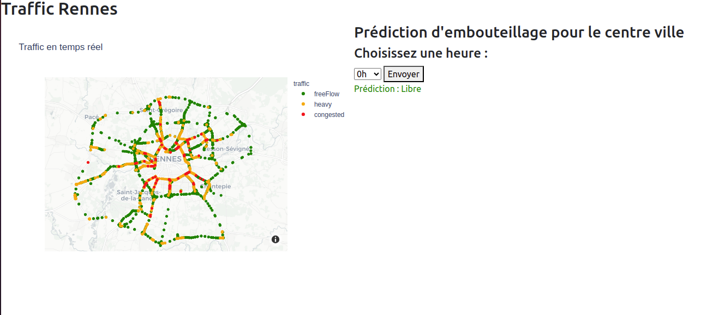

## **Rennes Traffic Monitoring**

L'application Rennes Traffic Monitoring permet de prédire l'état du trafic dans la ville de Rennes. Cette application est basée sur un modèle d'intelligence artificielle.

### **Utilisation**

Pour utiliser l'application, clonez ce projet à partir de la branche principale avec la commande suivante :

---
    git clone https://github.com/ilias21/e5_prop.git

### **Installation des dépendances**

Pour lancer l'application, il est recommandé de créer un environnement virtuel dans le même dossier que l'application. Pour cela, lancez la commande suivante :
---
    python -m venv venv

Une fois le dossier `venv` ajouté à votre application, vous pouvez installer les dépendances de l'application en utilisant la commande suivante :
---
    pip install -r requirements.txt

Cette commande permet d'installer toutes les bibliothèques dont votre application dépend.

### **Monitoring des demandes utilisateurs**

L'application permet de monitorer les demandes utilisateur en utilisant Flask Monitoring Dashboard, qui est lancé en même temps que l'application.

### **Configuration du serveur de messagerie**

Avant de démarrer l'application, vous devez lancer un serveur de messagerie, car l'application est conçue pour alerter l'administrateur en cas de dépassement des seuils des métriques suivantes :

1. **TIME_THRESHOLD** : en secondes, représente le seuil de temps d'exécution d'une requête.
2. **MEMORY_THRESHOLD** : en kilo-octets, représente le seuil de mémoire utilisée lors d'une requête.

Pour ce faire, commencez par lancer un serveur de messagerie local en utilisant la commande suivante dans un terminal séparé :
---
    python -m smtpd -c DebuggingServer -n localhost:1025

Cette commande lance un serveur email sur votre machine, ce qui permet de tester le service de messagerie.

### **Lancement de l'application**

Une fois les étapes précédentes réalisées, lancez la commande suivante pour démarrer le service :
---
    python app.py

L'application démarre le serveur Flask en local sur l'URL [http://127.0.0.1:5000](http://127.0.0.1:5000). En accédant à cette URL, vous aurez accès à la page suivante :

### **Acces a flask dashboard**

affin d'acceder au dashboard de flask visitez l'url [http://127.0.0.1:5000/dashboard] a noter que ce lien peut etre personnaliser dans le fichier de configuration de l'application en modifiant la valeur de `CUSTOM_LINK`, une fois lancer la page afficher est la suivante :

